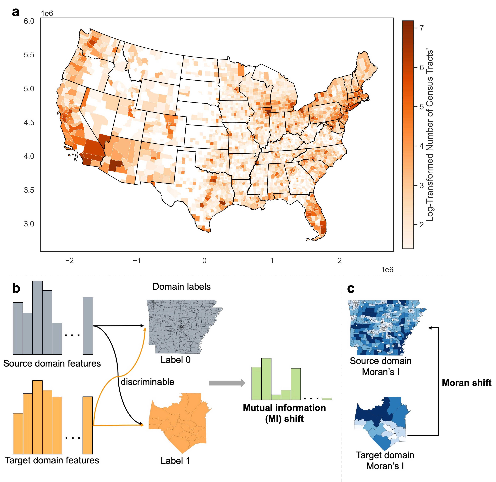

# GeoDomainShift-Mobility

**Quantifying geographic domain shift to decouple the geographic transferability of human mobility flow generations**

**Abstact**: Human mobility serves as an essential proxy for understanding social, economic, and environmental dynamics in urban systems. However, since human mobility data are often scarce due to high collection costs and privacy concerns, generating them from limited mobility observations or auxiliary data sources is highly needed. Geographic transferability, which measures the capability of a model in a new or unseen region, is a critical dimension to compare different human mobility generation models. However, few studies have studied the intrinsic characteristics of geographic transferability. To this end, this study systematically investigates the geographic transferability of four representative human mobility generation models using a large-scale benchmark dataset of census tract–level commuting flows across 2,265 counties in the United States. Inspired by domain adaptation theory in machine learning, we introduce geographic domain shift to describe the intrinsic differences in geographic feature distributions and spatial structures between source and target regions, which may jointly affect model transferability. Moreover, we propose two metrics, mutual information and spatial shift, to quantify the geographic domain shift. To examine their associations with geographic transferability, we employ linear mixed-effects regression to analyze the associations between geographic domain shifts and transferability. Our results reveal substantial heterogeneity and asymmetry in geographic transferability across regions. Both information shift and spatial shift exhibit statistically significant and complementary explanatory power. This indicates that geospatial transferability depends not only on model design but also on intrinsic geographic differences. These findings provide a novel methodological framework for evaluating and improving the geographic transferability of human mobility generation models and support more robust and fair human mobility data synthesis across diverse regions. It also offers insights on spatial transferability for GeoAI model development.



### 1. File Structure

```text
├── data
├── assets
    ├── Boundaries_Regions_within_Areas
    ├── img.png
    └── workflow.jpg
├── geo_data
└── models
    ├── 01_dataset-statisitcs.ipynb                   # Compute the statistics of the dataset
    ├── 02_spatial_domain_quantification.ipynb        # Quantify the geographic domain shifts of the datasets
    ├── 03_geoshift_clean_version.ipynb               # Analyze the assocaitions
    ├── DGM_raw                                       # DeepGravity model implementation
    ├── GBRT_states                                   # GBRT model implementation
    ├── GMEL_states                                   # GMEL model implementation
    └── RF_states                                     # Random foreset model implementation
```

## 2. Data Description

We use a large-scael commuting OD flow dataset, which is developed by [Tsinghua Fib Lab](https://github.com/tsinghua-fib-lab), as our comprehensive evaluations of geographic transferability of human mobility flow generations. In this repo, the *data* and *assests/Boundaries_Regions_within_Areas* folders are both empty. Please download the them via: https://github.com/tsinghua-fib-lab/CommutingODGen-Dataset, which are in the directories with same names.

## 2. Human mobility generation model implementations

### 2.1. Code adaptation of human mobility flow generaations

The four representative human mobility generation models include: DeepGravity, RF, GBRT, and GMEL. The codes are adapted from the implementations of Tsinghua Fib Lab: https://github.com/tsinghua-fib-lab/CommutingODGen-Dataset. Specfically, take the DeepGravity model under *models* as an example:

* In *model.py* file, following the original implemention of [DeepGravity paper](https://www.nature.com/articles/s41467-021-26752-4), we removed the tanh() operation for the linear output.
* To enable the spatially held-out training, we developed an ODFlowDataset dataloader, which is detailed in *utils.py* file.
* Furthermore, we added the functions of loading data and constructing training sets and test sets by states, *load_state_areas()*, *load_data_by_states.py* in *data_load.py* file.

### 2.2. Geographic domain shift quantification and analysis

* Please run *01_dataset-statisitcs.ipynb* to get the descriptive statistics of the used dataset.
* Please run *02_spatial_domain_quantification.ipynb* to quantify the geographic domain shift across different U.S states.
* Please run *03_geoshift_clean_version.ipynb* to analzye the associations between the geographic domain shift and geographic transferability of OD moiblity flow generation models.

### 3 Acknowledgements

We acknowledge the [Postdoc.Mobility Fellowship (No. 235381)](https://data.snf.ch/grants/grant/235381) funded by the Swiss National Science Foundation in supporting this research. We are also grateful to the open source of the large scale OD commuting flow datasets by [Tsinghua Fib Lab](https://github.com/tsinghua-fib-lab).
